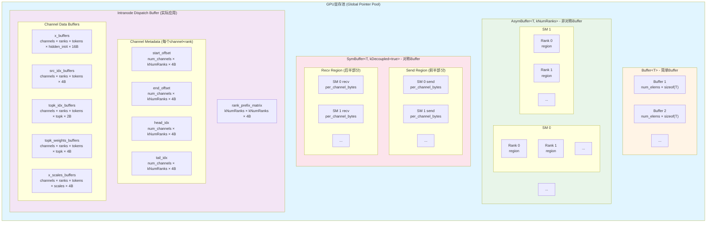
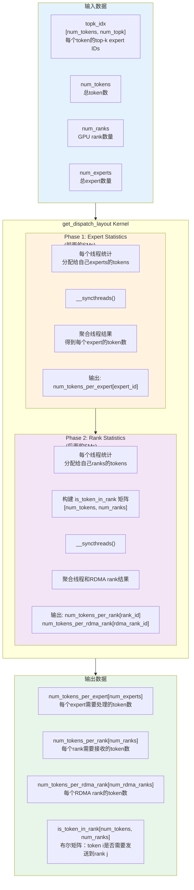
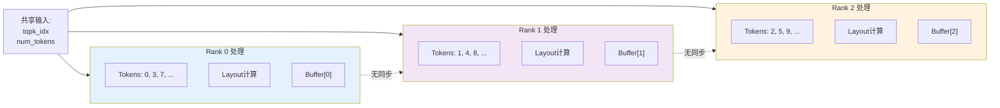
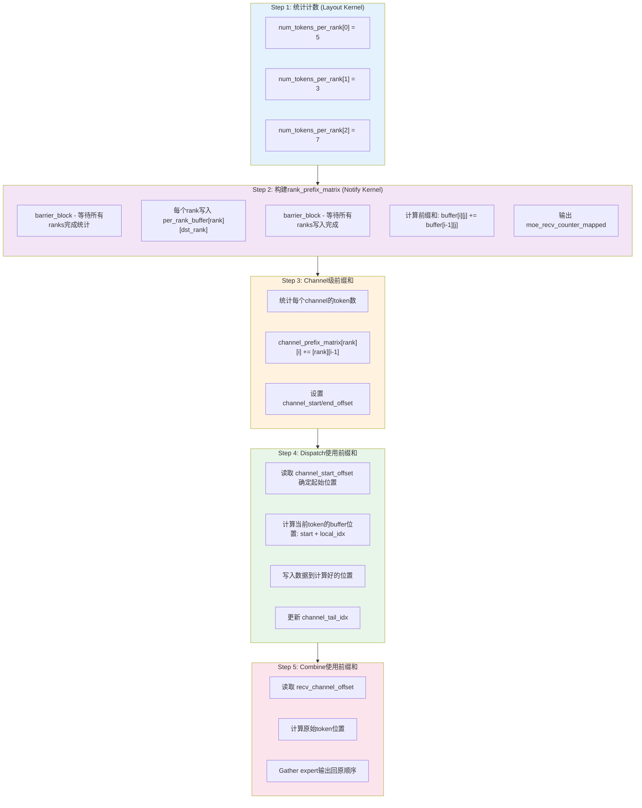
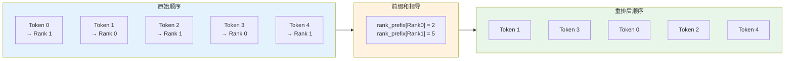
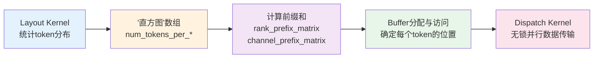

# DeepEP Buffer与Tensor Layout深度分析

## 目录
1. [Buffer构建逐行分析与显存布局](#1-buffer构建逐行分析与显存布局)
2. [Layout构造机制与并行处理](#2-layout构造机制与并行处理)
3. [直方图与前缀和的作用](#3-直方图与前缀和的作用)

---

## 1. Buffer构建逐行分析与显存布局

### 1.1 三种Buffer类型概览

DeepEP使用三种模板化的Buffer结构来管理GPU显存，定义在 `csrc/kernels/buffer.cuh`：

| Buffer类型 | 用途 | 关键特性 |
|-----------|------|---------|
| `Buffer<dtype_t>` | 简单对称buffer | 单指针，固定大小 |
| `AsymBuffer<dtype_t, kNumRanks>` | 非对称多rank buffer | 每个rank独立指针数组 |
| `SymBuffer<dtype_t, kDecoupled>` | 对称发送/接收buffer | 分离的send/recv指针 |

---

### 1.2 Buffer构建逐行分析

#### **Buffer 构造函数** (`buffer.cuh:18-22`)

```cpp
__device__ __forceinline__ Buffer(void*& gbl_ptr, int num_elems, int offset = 0) {
    total_bytes = num_elems * sizeof(dtype_t);              // 计算总字节数
    ptr = static_cast<uint8_t*>(gbl_ptr) + offset * sizeof(dtype_t);  // 设置起始指针（带偏移）
    gbl_ptr = static_cast<uint8_t*>(gbl_ptr) + total_bytes; // 推进全局指针
}
```

**工作原理**：
- **输入**：全局指针引用 `gbl_ptr`（指向可用显存池），元素数量 `num_elems`，可选偏移量
- **操作**：
  1. 计算需要的字节数（元素数 × 类型大小）
  2. 从全局指针+偏移位置开始分配
  3. **推进全局指针**：这是关键！通过修改 `gbl_ptr` 引用，下一个buffer会从当前buffer末尾开始分配
- **结果**：返回typed指针，支持 `buffer()[idx]` 访问

---

#### **AsymBuffer 构造函数 - 单rank模式** (`buffer.cuh:43-51`)

```cpp
__device__ __forceinline__ AsymBuffer(void*& gbl_ptr, int num_elems, int num_ranks,
                                       int sm_id = 0, int num_sms = 1, int offset = 0) {
    EP_STATIC_ASSERT(kNumRanks == 1, "");
    num_bytes = num_elems * sizeof(dtype_t);  // 每个元素所需字节数

    int64_t per_channel_bytes = num_bytes * num_ranks;  // 每个通道字节数 = 元素字节 × ranks
    total_bytes = per_channel_bytes * num_sms;           // 总字节 = 通道字节 × SMs数量

    // 计算当前SM的buffer起始位置
    ptrs[0] = static_cast<uint8_t*>(gbl_ptr) + per_channel_bytes * sm_id + num_bytes * offset;
    gbl_ptr = static_cast<uint8_t*>(gbl_ptr) + total_bytes;  // 推进全局指针
}
```

**关键设计**：
- **per-SM分配**：每个SM有独立的buffer区域（`per_channel_bytes * sm_id`）
- **per-rank子分区**：每个SM内部按rank分区（`num_bytes * offset`）
- **显存布局**：`[SM0_rank0|SM0_rank1|...|SM1_rank0|SM1_rank1|...]`

---

#### **AsymBuffer 构造函数 - 多rank模式** (`buffer.cuh:53-63`)

```cpp
__device__ __forceinline__ AsymBuffer(void** gbl_ptrs, int num_elems, int num_ranks,
                                       int sm_id = 0, int num_sms = 1, int offset = 0) {
    EP_STATIC_ASSERT(kNumRanks > 1, "");
    num_bytes = num_elems * sizeof(dtype_t);

    int64_t per_channel_bytes = num_bytes * num_ranks;
    total_bytes = per_channel_bytes * num_sms;

    // 为每个rank分配独立的指针
    for (int i = 0; i < kNumRanks; ++i) {
        ptrs[i] = static_cast<uint8_t*>(gbl_ptrs[i]) + per_channel_bytes * sm_id + num_bytes * offset;
        gbl_ptrs[i] = static_cast<uint8_t*>(gbl_ptrs[i]) + total_bytes;  // 每个rank独立推进
    }
}
```

**多rank特性**：
- **输入**：指针数组 `gbl_ptrs`（每个rank一个全局指针）
- **独立显存池**：每个rank有自己的显存池，支持跨GPU内存访问
- **用途**：用于RDMA场景，每个rank可能在不同GPU上

---

#### **SymBuffer 构造函数** (`buffer.cuh:105-113`)

```cpp
__device__ __forceinline__ SymBuffer(void*& gbl_ptr, int num_elems, int num_ranks,
                                      int sm_id = 0, int num_sms = 1) {
    num_bytes = num_elems * sizeof(dtype_t);

    int64_t per_channel_bytes = num_bytes * num_ranks;
    total_bytes = per_channel_bytes * num_sms * (static_cast<int>(kDecoupled) + 1);

    // 发送buffer在前半部分
    send_ptr = static_cast<uint8_t*>(gbl_ptr) + per_channel_bytes * sm_id;

    // 接收buffer在后半部分（跳过所有SM的send区域）
    recv_ptr = static_cast<uint8_t*>(gbl_ptr) + per_channel_bytes * (sm_id + num_sms);

    gbl_ptr = static_cast<uint8_t*>(gbl_ptr) + total_bytes;
}
```

**对称设计**：
- **Decoupled模式**：`total_bytes = per_channel_bytes * num_sms * 2`
  - 前半部分：所有SM的send buffers
  - 后半部分：所有SM的recv buffers
- **Non-decoupled模式**：`total_bytes = per_channel_bytes * num_sms`
  - 只使用 `send_ptr`，通过 `buffer(idx)` 访问

---

### 1.3 显存布局Mermaid图



**显存分配顺序（通过gbl_ptr推进）**：
1. `rank_prefix_matrix` 首先分配
2. 然后依次分配 `start_offset`, `end_offset`, `head_idx`, `tail_idx`
3. 最后分配大数据buffers（`x_buffers`, `src_idx_buffers` 等）

**关键要点**：
- **gbl_ptr引用传递**：每次Buffer构造后自动推进，实现连续分配
- **SM并行**：每个SM有独立的buffer区域，避免竞争
- **类型安全**：模板化设计支持任意数据类型
- **对齐优化**：所有buffer自动按类型大小对齐

---

### 1.4 Buffer使用示例（intranode.cu:257-277）

```cpp
// 从共享buffer指针pool中计算各个buffer的位置
auto ptr = reinterpret_cast<void*>(
    static_cast<int8_t*>(buffer_ptrs[is_sender ? responsible_rank : rank])
    + kNumRanks * kNumRanks * sizeof(int)  // 跳过rank_prefix_matrix
);

// 通道偏移计算
auto channel_rank_offset = responsible_channel * kNumRanks + target_rank;

// 使用Buffer构造函数依次分配
auto channel_start_offset = Buffer<int>(ptr, num_channels_total, channel_rank_offset);
auto channel_end_offset = Buffer<int>(ptr, num_channels_total, channel_rank_offset);
auto channel_head_idx = Buffer<int>(ptr, num_channels_total, channel_rank_offset);
auto channel_tail_idx = Buffer<int>(ptr, num_channels_total, channel_rank_offset);

// 分配数据buffers
auto channel_x_buffers = Buffer<int4>(
    ptr,
    num_channels_total * num_recv_buffer_tokens * hidden_int4,
    channel_rank_offset * num_recv_buffer_tokens * hidden_int4
);
auto channel_src_idx_buffers = Buffer<int>(
    ptr,
    num_channels_total * num_recv_buffer_tokens,
    channel_rank_offset * num_recv_buffer_tokens
);
// ... 更多buffers
```

**工作流程**：
1. 从预分配的 `buffer_ptrs[rank]` 获取起始地址
2. 跳过 `rank_prefix_matrix` 区域
3. 依次构造各个Buffer，`ptr` 引用自动推进
4. 每个Buffer知道自己在显存中的位置和大小

---

## 2. Layout构造机制与并行处理

### 2.1 Layout的目的

**核心问题**：在MoE（Mixture of Experts）中，每个token需要路由到不同的experts，这些experts可能分布在不同的GPU ranks上。如何高效地：
1. 统计哪些tokens需要发送到哪些ranks/experts
2. 在多个ranks之间并行处理
3. 只处理必要的tensor部分（避免全量拷贝）

**解决方案**：`get_dispatch_layout` kernel

---

### 2.2 Layout Kernel架构（layout.cu:9-121）



---

### 2.3 如何实现"只处理一部分tensor"

#### **关键机制：is_token_in_rank 布尔矩阵**

`layout.cu:90-94`:
```cpp
auto shifted_is_token_in_rank = is_token_in_rank + i * num_ranks;
#pragma unroll
for (int j = 0; j + rank_begin_idx < rank_end_idx; ++j) {
    shifted_is_token_in_rank[j + rank_begin_idx] = (is_in_rank[j] > 0);  // 布尔标记
    num_tokens_per_rank_per_thread[thread_id][j] += (is_in_rank[j] > 0); // 计数
}
```

**工作原理**：
1. **稀疏标记**：`is_token_in_rank[token_id * num_ranks + rank_id]` 为 `true` 表示 token `token_id` 需要发送到 rank `rank_id`
2. **选择性处理**：在后续的dispatch kernel中，只有当 `is_token_in_rank[token_idx * kNumRanks + responsible_rank]` 为true时才处理该token

**示例**（intranode.cu:348-349）：
```cpp
// 跳过不需要发送到当前rank的token
if (not is_token_in_rank[token_idx * kNumRanks + responsible_rank]) {
    ++token_idx;
    continue;  // 直接跳过，不拷贝数据
}
```

---

### 2.4 如何保证多个rank并行处理

#### **策略1：SM级并行**

`layout.cu:133-134`:
```cpp
constexpr int kNumThreads = 256, kNumExpertsPerSM = 4, kNumRanksPerSM = 8;
int num_sms = ((num_experts + kNumExpertsPerSM - 1) / kNumExpertsPerSM)
            + (num_ranks + kNumRanksPerSM - 1) / kNumRanksPerSM;
```

**SM分工**：
- **前 `⌈num_experts/4⌉` 个SMs**：处理expert统计
- **后 `⌈num_ranks/8⌉` 个SMs**：处理rank统计
- 每个SM处理独立的expert/rank范围，无数据竞争

---

#### **策略2：线程级并行**

`layout.cu:31-38`:
```cpp
#pragma unroll
for (int i = thread_id; i < num_tokens; i += kNumThreads) {  // stride访问
    auto shifted_topk_idx = topk_idx + i * num_topk;
    #pragma unroll
    for (int j = 0, expert_idx; j < num_topk; ++j) {
        expert_idx = static_cast<int>(shifted_topk_idx[j]);
        if (expert_begin_idx <= expert_idx and expert_idx < expert_end_idx)
            ++num_tokens_per_expert_per_thread[thread_id][expert_idx - expert_begin_idx];
    }
}
```

**并行模式**：
- 每个线程处理 `num_tokens/kNumThreads` 个tokens（stride = kNumThreads）
- 使用 **shared memory** 存储per-thread计数，避免全局内存原子操作
- 最后通过reduction聚合线程结果

---

#### **策略3：Rank间独立数据结构**



**无锁设计**：
- 每个rank写入独立的 `num_tokens_per_rank[rank_id]` 位置
- 每个rank有独立的buffer区域（AsymBuffer设计）
- 只在必要时通过barrier同步（如 `barrier_block<kNumRanks>()`）

---

### 2.5 Expert到Rank的映射

`layout.cu:65-67, 83-86`:
```cpp
const auto num_expert_per_rank = num_experts / num_ranks;  // 假设均匀分布
auto expert_begin = rank_begin_idx * num_expert_per_rank;
auto expert_end = rank_end_idx * num_expert_per_rank;

// ...
expert_idx = static_cast<int>(shifted_topk_idx[j]);
if (expert_begin <= expert_idx and expert_idx < expert_end) {
    rank_idx = expert_idx / num_expert_per_rank - rank_begin_idx;  // 计算rank索引
    is_in_rank[rank_idx]++, is_in_rdma_rank[rank_idx / NUM_MAX_NVL_PEERS]++;
}
```

**映射规则**：
- **均匀分片**：`rank_id = expert_id / (num_experts / num_ranks)`
- **示例**：8个experts，2个ranks → rank0处理experts 0-3，rank1处理experts 4-7
- **RDMA分组**：每 `NUM_MAX_NVL_PEERS`（通常8）个ranks组成一个RDMA组

---

## 3. 直方图与前缀和的作用

### 3.1 "直方图"是什么

**术语澄清**：DeepEP中没有显式的"直方图"数据结构，但有**类似直方图的计数数组**：

| 数组名称 | 维度 | 含义 | 计算位置 |
|---------|------|------|---------|
| `num_tokens_per_expert` | `[num_experts]` | 每个expert需要处理的token数 | layout.cu:49 |
| `num_tokens_per_rank` | `[num_ranks]` | 每个rank需要接收的token数 | layout.cu:110 |
| `num_tokens_per_rdma_rank` | `[num_rdma_ranks]` | 每个RDMA rank的token数 | layout.cu:118 |

这些计数数组类似于**直方图的bins**，统计tokens在不同categories（experts/ranks）中的分布。

---

### 3.2 为什么需要这些"直方图"

#### **原因1：内存预分配**

在dispatch之前，需要知道每个rank会接收多少tokens，从而：
- 分配足够的接收buffer
- 避免buffer溢出
- 优化内存使用

#### **原因2：负载均衡**

通过统计 `num_tokens_per_expert`，可以：
- 检测负载不均（某些experts处理过多tokens）
- 动态调整expert分配策略
- 优化计算资源利用率

#### **原因3：生成前缀和的基础**

直方图数据是计算前缀和的输入，前缀和用于确定每个token在buffer中的位置。

---

### 3.3 前缀和（Prefix Sum）详解

#### **核心数据结构：rank_prefix_matrix**

`intranode.cu:56-64`:
```cpp
// 计算rank间token传输的累积和
auto local_per_rank_buffer = static_cast<int*>(buffer_ptrs[rank]);
if (thread_id < kNumRanks) {
    #pragma unroll
    for (int i = 1; i < kNumRanks; ++i)
        local_per_rank_buffer[i * kNumRanks + thread_id] +=
            local_per_rank_buffer[(i - 1) * kNumRanks + thread_id];  // 累加

    if (thread_id == rank)
        *moe_recv_counter_mapped = local_per_rank_buffer[(kNumRanks - 1) * kNumRanks + rank];
}
```

**计算结果**：
```
rank_prefix_matrix[i][j] = sum(num_tokens from rank 0..i to rank j)

示例（3 ranks）：
原始计数矩阵（from_rank × to_rank）:
         to_0  to_1  to_2
from_0  [  5     3     2  ]
from_1  [  4     6     1  ]
from_2  [  2     5     3  ]

前缀和矩阵：
         to_0  to_1  to_2
累计0   [  5     3     2  ]
累计0-1 [  9     9     3  ]  ← from_0和from_1累加
累计0-2 [ 11    14     6  ]  ← from_0、from_1、from_2全部累加
```

---

#### **前缀和应用1：确定buffer偏移量**

`intranode.cu:106-111`:
```cpp
// 计算channel级别的前缀和
if (thread_id == 0) {
    #pragma unroll
    for (int i = 1; i < num_channels; ++i)
        channel_prefix_matrix[dst_rank * num_channels + i] +=
            channel_prefix_matrix[dst_rank * num_channels + i - 1];
}
```

`intranode.cu:307-310`:
```cpp
// 使用前缀和设置channel的起始和结束偏移
int value = responsible_channel > 0 ?
    channel_prefix_matrix[responsible_rank * num_channels + responsible_channel - 1] : 0;
st_relaxed_sys_global(channel_start_offset.buffer(), -value - 1);  // 起始偏移

value = channel_prefix_matrix[responsible_rank * num_channels + responsible_channel];
st_relaxed_sys_global(channel_end_offset.buffer(), -value - 1);    // 结束偏移
```

**工作原理**：
```
假设 channel_prefix_matrix[rank2] = [5, 12, 20, 25]（4个channels）

Channel 0: start = 0,  end = 5   → 处理 tokens 0-4
Channel 1: start = 5,  end = 12  → 处理 tokens 5-11
Channel 2: start = 12, end = 20  → 处理 tokens 12-19
Channel 3: start = 20, end = 25  → 处理 tokens 20-24
```

**优势**：
- **无重叠**：每个channel处理不同的token范围
- **连续存储**：tokens在buffer中连续排列，提高缓存命中率
- **并行友好**：channels可以并行dispatch，无需同步

---

#### **前缀和应用2：Scatter-Gather操作**

在combine阶段（`csrc/deep_ep.cpp:778-802`），使用前缀和快速定位：

```cpp
// 通过前缀和直接计算output位置
int output_offset = recv_channel_offset[rank_id * num_channels + channel_id];
int position = output_offset + local_token_idx;  // 前缀和 + 局部索引

// Gather expert输出回原始token顺序
output[token_id] = expert_output[position];
```

**对比传统方法**：

| 方法 | 时间复杂度 | 需要同步 |
|-----|-----------|---------|
| **传统（原子操作）** | O(n) + 原子竞争 | 是 |
| **前缀和** | O(n) 预计算 + O(1) 查找 | 否 |

---

### 3.4 前缀和计算的完整流程



---

### 3.5 前缀和的数学本质

#### **定义**

给定数组 `A = [a₀, a₁, a₂, ..., aₙ₋₁]`，前缀和数组 `P` 定义为：
```
P[i] = Σ(k=0 to i) A[k]
```

#### **在DeepEP中的应用**

1. **一维前缀和**（channel_prefix_matrix）：
```cpp
P[i] = P[i-1] + A[i]  // A[i] = 当前channel的token数
```

2. **二维前缀和**（rank_prefix_matrix）：
```cpp
P[i][j] = P[i-1][j] + M[i][j]  // M[i][j] = from_rank i to_rank j的token数
```

3. **查询范围和**：
```cpp
sum(A[l..r]) = P[r] - P[l-1]  // O(1)时间复杂度
```

---

### 3.6 为什么前缀和如此重要

#### **1. 避免原子操作**

**传统方法**（需要原子操作）：
```cpp
// 每个线程竞争同一个位置
int pos = atomicAdd(&global_counter[rank], 1);
buffer[pos] = my_data;  // 高竞争，性能差
```

**前缀和方法**（无锁）：
```cpp
// 预先计算好每个线程的写入范围
int my_start = channel_prefix_matrix[channel_id - 1];  // 前缀和查询
int my_end = channel_prefix_matrix[channel_id];
for (int i = my_start; i < my_end; ++i)
    buffer[i] = my_data[i - my_start];  // 无竞争
```

---

#### **2. 支持批量处理**

前缀和允许一次性处理整个batch的tokens，而不是逐个处理：

```cpp
// 一次性知道所有tokens的位置
for (int token_id = 0; token_id < num_tokens; ++token_id) {
    int channel_id = get_channel(token_id);
    int local_idx = token_id - channel_start[channel_id];
    int buffer_pos = channel_prefix_matrix[channel_id - 1] + local_idx;
    send_buffer[buffer_pos] = tokens[token_id];
}
```

---

#### **3. 实现高效的数据重排**



**代码实现**：
```cpp
int counters[num_ranks] = {0};  // 局部计数器
for (int token_id = 0; token_id < num_tokens; ++token_id) {
    int target_rank = get_rank(token_id);

    // 使用前缀和计算起始位置
    int base_offset = (target_rank > 0) ? rank_prefix_matrix[target_rank - 1] : 0;
    int position = base_offset + counters[target_rank]++;

    reordered_buffer[position] = original_tokens[token_id];
}
```

---

## 总结

### Buffer构建的核心思想
- **引用传递推进**：`gbl_ptr` 引用自动推进，实现连续内存分配
- **模板化灵活性**：支持不同数据类型和通信模式（对称/非对称）
- **SM级隔离**：每个SM有独立buffer区域，减少竞争

### Layout的核心思想
- **稀疏处理**：通过 `is_token_in_rank` 矩阵只处理必要的tokens
- **层次化并行**：SM级 + 线程级 + rank级多层并行
- **无锁设计**：独立数据结构避免同步开销

### 前缀和的核心作用
- **预计算位置**：O(n) 预处理 + O(1) 查询，避免运行时原子操作
- **批量处理**：支持整个batch的并行处理
- **内存连续性**：确保相关数据连续存储，提高缓存命中率

### 三者的协同工作



**关键洞察**：
1. **Layout** 确定"谁发送什么"（稀疏化）
2. **直方图** 统计"发送多少"（内存规划）
3. **前缀和** 计算"发送到哪里"（位置映射）
4. **Buffer** 提供"如何访问"（内存管理）

这四个组件共同实现了高效的、无锁的、并行的MoE token分发与收集机制。
