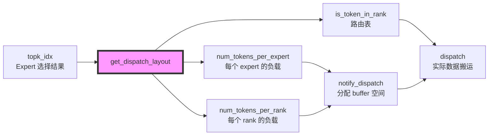

# get_dispatch_layout 函数程序员视角分析

## 1. 函数签名与 API 设计

### Python 层 API (buffer.py:293-319)

```python
def get_dispatch_layout(
    self,
    topk_idx: torch.Tensor,           # [num_tokens, num_topk] int64
    num_experts: int,                 # 专家总数
    previous_event: Optional[EventOverlap] = None,
    async_finish: bool = False,
    allocate_on_comm_stream: bool = False
) -> Tuple[
    torch.Tensor,  # num_tokens_per_rank [num_ranks]
    Optional[torch.Tensor],  # num_tokens_per_rdma_rank [num_rdma_ranks] or None
    torch.Tensor,  # num_tokens_per_expert [num_experts]
    torch.Tensor,  # is_token_in_rank [num_tokens, num_ranks]
    EventOverlap   # CUDA event
]
```

### CUDA Kernel 签名 (layout.cu:123-149)

```cpp
void get_dispatch_layout(
    const topk_idx_t* topk_idx,        // 输入: [num_tokens, num_topk]
    int* num_tokens_per_rank,          // 输出: [num_ranks]
    int* num_tokens_per_rdma_rank,     // 输出: [num_rdma_ranks] (可选)
    int* num_tokens_per_expert,        // 输出: [num_experts]
    bool* is_token_in_rank,            // 输出: [num_tokens, num_ranks]
    int num_tokens,                    // 标量参数
    int num_topk,
    int num_ranks,
    int num_experts,
    cudaStream_t stream
);
```

---

## 2. 核心功能：计算路由元数据

这个函数的本质是**计算直方图（histogram）+ 前缀和（prefix sum）的前半部分**。

### 输入数据结构

```
topk_idx: [num_tokens, num_topk]
例如 num_tokens=1000, num_topk=2, num_experts=128, num_ranks=8

topk_idx = [
  [45, 67],   # Token 0 选择了 expert 45 和 67
  [12, 45],   # Token 1 选择了 expert 12 和 45
  [67, 89],   # Token 2 选择了 expert 67 和 89
  ...
]
```

### 输出数据结构

#### 1. num_tokens_per_expert: `[num_experts]`
```
每个 expert 将接收多少个 token

例如:
num_tokens_per_expert[45] = 350   # expert 45 将处理 350 个 tokens
num_tokens_per_expert[67] = 280   # expert 67 将处理 280 个 tokens
```

#### 2. num_tokens_per_rank: `[num_ranks]`
```
每个 GPU rank 将接收多少个 token

例如 (假设 128 experts 均分到 8 ranks, 每 rank 16 experts):
num_tokens_per_rank[0] = 245   # Rank 0 (experts 0-15) 接收 245 tokens
num_tokens_per_rank[1] = 198   # Rank 1 (experts 16-31) 接收 198 tokens
```

#### 3. is_token_in_rank: `[num_tokens, num_ranks]` (bool)
```
标记每个 token 是否需要发送到某个 rank

例如:
is_token_in_rank[0] = [False, False, True, False, True, False, False, False]
# Token 0 需要发送到 rank 2 和 rank 4
```

#### 4. num_tokens_per_rdma_rank: `[num_rdma_ranks]` (可选)
```
跨节点 RDMA 场景下，每个 RDMA rank 接收多少 token
仅在多节点配置下使用
```

---

## 3. 实现架构：两阶段分离设计

### 为什么分两个阶段？

Kernel 采用**SM 级并行**的设计，不同 SM 负责不同的统计任务：

```
Total SMs = Expert SMs + Rank SMs

Expert SMs: ⌈num_experts / kNumExpertsPerSM⌉
Rank SMs:   ⌈num_ranks / kNumRanksPerSM⌉
```

**示例配置** (layout.cu:133):
- `kNumThreads = 256`
- `kNumExpertsPerSM = 4`  ← 每个 SM 处理 4 个 experts
- `kNumRanksPerSM = 8`    ← 每个 SM 处理 8 个 ranks

对于 128 experts, 8 ranks:
```
Expert SMs = ⌈128/4⌉ = 32 个 SM
Rank SMs   = ⌈8/8⌉   = 1 个 SM
Total      = 33 个 SM
```

---

## 4. 阶段一：Expert 统计 (layout.cu:22-52)

### 4.1 算法流程

```cpp
// 步骤 1: 每个 SM 负责 kNumExpertsPerSM 个 experts
int expert_begin_idx = sm_id * kNumExpertsPerSM;  // 例如 SM 0: experts 0-3
int expert_end_idx = min(expert_begin_idx + kNumExpertsPerSM, num_experts);

// 步骤 2: Shared memory 存储每个线程的局部计数
__shared__ int num_tokens_per_expert_per_thread[kNumThreads][kNumExpertsPerSM];
// 256 threads × 4 experts = 1024 ints = 4KB shared memory

// 步骤 3: 每个线程遍历自己负责的 tokens (grid-stride loop)
for (int i = thread_id; i < num_tokens; i += kNumThreads) {
    auto shifted_topk_idx = topk_idx + i * num_topk;
    for (int j = 0; j < num_topk; ++j) {
        expert_idx = static_cast<int>(shifted_topk_idx[j]);
        if (expert_begin_idx <= expert_idx && expert_idx < expert_end_idx)
            ++num_tokens_per_expert_per_thread[thread_id][expert_idx - expert_begin_idx];
    }
}

// 步骤 4: Reduction - 将所有线程的计数汇总
__syncthreads();
if (expert_begin_idx + thread_id < expert_end_idx) {
    int sum = 0;
    for (int i = 0; i < kNumThreads; ++i)
        sum += num_tokens_per_expert_per_thread[i][thread_id];
    num_tokens_per_expert[expert_begin_idx + thread_id] = sum;
}
```

### 4.2 为什么用 Per-Thread Counting？

**避免原子操作竞争！**

❌ **错误方案**: 直接用 atomicAdd
```cpp
// 所有线程竞争同一个 expert 的计数器
atomicAdd(&num_tokens_per_expert[expert_idx], 1);  // 大量竞争！
```

✅ **正确方案**: Per-Thread + Reduction
```cpp
// Phase 1: 每个线程独立计数（无竞争）
num_tokens_per_expert_per_thread[thread_id][local_expert_idx]++;

// Phase 2: 单次 reduction（256 次读取，1 次写入）
sum = reduce(num_tokens_per_expert_per_thread[:][expert_idx]);
```

**性能对比** (256 threads, 假设每个 expert 有 1000 个 tokens):
- atomicAdd: 1000 次原子操作/expert = **高延迟 + 串行化**
- Per-thread + Reduce: 256 次独立计数 + 1 次汇总 = **并行 + 无竞争**

### 4.3 内存访问模式

**读取 topk_idx**:
```
Thread 0: topk_idx[0], topk_idx[256], topk_idx[512], ...   (stride = kNumThreads)
Thread 1: topk_idx[1], topk_idx[257], topk_idx[513], ...
Thread 2: topk_idx[2], topk_idx[258], topk_idx[514], ...
...
```
→ **Coalesced access** (连续 128 bytes per warp)

**写入 shared memory**:
```
num_tokens_per_expert_per_thread[thread_id][expert_idx - expert_begin_idx]
```
→ 每个线程写入自己的行，**无 bank conflict**

---

## 5. 阶段二：Rank 统计 (layout.cu:54-120)

### 5.1 Rank 映射关系

```
Expert → Rank 映射:
num_expert_per_rank = num_experts / num_ranks

例如 128 experts, 8 ranks:
Rank 0: Experts 0-15
Rank 1: Experts 16-31
Rank 2: Experts 32-47
...
Rank 7: Experts 112-127

Expert ID → Rank ID:
rank_id = expert_id / num_expert_per_rank
例如: expert 45 → rank 45/16 = rank 2
```

### 5.2 核心逻辑

```cpp
for (int i = thread_id; i < num_tokens; i += kNumThreads) {
    auto shifted_topk_idx = topk_idx + i * num_topk;
    int is_in_rank[kNumRanksPerSM] = {0};  // 局部标记数组

    // 检查 token i 的所有 topk expert 属于哪些 ranks
    for (int j = 0; j < num_topk; ++j) {
        expert_idx = static_cast<int>(shifted_topk_idx[j]);
        if (expert_begin <= expert_idx && expert_idx < expert_end) {
            rank_idx = expert_idx / num_expert_per_rank - rank_begin_idx;
            is_in_rank[rank_idx]++;  // 标记该 token 需要发到这个 rank
        }
    }

    // 写入输出
    for (int j = 0; j + rank_begin_idx < rank_end_idx; ++j) {
        // 布尔输出: token i 是否发送到 rank j
        shifted_is_token_in_rank[j + rank_begin_idx] = (is_in_rank[j] > 0);
        // 累加计数
        num_tokens_per_rank_per_thread[thread_id][j] += (is_in_rank[j] > 0);
    }
}
```

### 5.3 关键优化：is_in_rank 局部数组

**为什么用局部数组而不是直接写 global memory？**

```cpp
// ❌ 低效方案: 每次都读写 global memory
for (int j = 0; j < num_topk; ++j) {
    rank_idx = expert_idx / num_expert_per_rank;
    is_token_in_rank[i * num_ranks + rank_idx] = true;  // 重复写入！
}

// ✅ 高效方案: 先在寄存器累加，最后写一次
int is_in_rank[kNumRanksPerSM] = {0};  // 寄存器变量
for (int j = 0; j < num_topk; ++j) {
    rank_idx = ...;
    is_in_rank[rank_idx]++;  // 纯寄存器操作
}
// 最后一次性写入 global memory
for (int j = 0; j < kNumRanksPerSM; ++j) {
    is_token_in_rank[...] = (is_in_rank[j] > 0);  // 1 次写入
}
```

**性能提升**:
- 寄存器访问延迟: ~1 cycle
- Global memory 访问延迟: ~200-400 cycles
- 对于 num_topk=2, 节省 1 次 global memory 写入

### 5.4 RDMA Rank 统计 (可选)

```cpp
// Multi-node 场景: 同一物理节点的 GPU 组成一个 RDMA rank
constexpr int kNumRDMARanksPerSM = kNumRanksPerSM / NUM_MAX_NVL_PEERS;
// NUM_MAX_NVL_PEERS = 8 (一个节点最多 8 个 GPU)

// 例如 64 ranks (8 nodes × 8 GPUs), NUM_MAX_NVL_PEERS=8:
// RDMA Rank 0: GPU ranks 0-7   (Node 0)
// RDMA Rank 1: GPU ranks 8-15  (Node 1)
// ...
// RDMA Rank 7: GPU ranks 56-63 (Node 7)

is_in_rdma_rank[rank_idx / NUM_MAX_NVL_PEERS]++;
```

---

## 6. 算法复杂度分析

### 时间复杂度

**Expert 统计阶段**:
```
每个 SM 处理: O(num_tokens × num_topk / num_threads)
Reduction:   O(num_threads)

Total: O(num_tokens × num_topk / (num_threads × num_expert_sms))
```

**Rank 统计阶段**:
```
同样的 O(num_tokens × num_topk / (num_threads × num_rank_sms))
```

**整体复杂度**: `O(num_tokens × num_topk / num_threads)`
- 对于 1M tokens, topk=2, 256 threads: ~8K iterations/thread

### 空间复杂度

**Shared Memory (per SM)**:
```
Expert 阶段:
sizeof(int) × kNumThreads × kNumExpertsPerSM
= 4 bytes × 256 × 4 = 4 KB

Rank 阶段:
sizeof(int) × kNumThreads × kNumRanksPerSM × 2  (rank + rdma_rank)
= 4 bytes × 256 × 8 × 2 = 16 KB

Total per SM: ~20 KB (远小于 H100 的 228 KB shared memory 上限)
```

**Global Memory**:
```
Inputs:  topk_idx [num_tokens × num_topk × 8B]
Outputs:
  - num_tokens_per_expert [num_experts × 4B]
  - num_tokens_per_rank [num_ranks × 4B]
  - is_token_in_rank [num_tokens × num_ranks × 1B]  ← 最大的输出

例如 1M tokens, 8 ranks:
is_token_in_rank = 1M × 8 = 8 MB
```

---

## 7. 性能优化技巧

### 7.1 Grid-Stride Loop

```cpp
for (int i = thread_id; i < num_tokens; i += kNumThreads) {
    // ...
}
```

**优势**:
- **自动负载均衡**: 无需手动计算每个线程的工作量
- **适配任意 num_tokens**: 无需 padding 或边界处理
- **Coalesced access**: 相邻线程访问相邻内存

### 7.2 #pragma unroll

```cpp
#pragma unroll
for (int j = 0; j < num_topk; ++j) {
    expert_idx = static_cast<int>(shifted_topk_idx[j]);
    // ...
}
```

**编译器展开循环** (num_topk=2):
```cpp
// 展开后:
expert_idx = shifted_topk_idx[0];
if (expert_begin_idx <= expert_idx && expert_idx < expert_end_idx)
    ++num_tokens_per_expert_per_thread[thread_id][expert_idx - expert_begin_idx];

expert_idx = shifted_topk_idx[1];
if (expert_begin_idx <= expert_idx && expert_idx < expert_end_idx)
    ++num_tokens_per_expert_per_thread[thread_id][expert_idx - expert_begin_idx];
```

**性能提升**:
- 消除循环开销 (分支预测、循环计数器)
- 增加指令级并行 (ILP)
- 对于小循环 (num_topk=2) 非常有效

### 7.3 Early Return

```cpp
if (expert_begin_idx < expert_end_idx) {
    // Expert 统计代码
    return;  // ← 提前返回！
}

// Rank 统计代码
```

**避免不必要的执行**:
- Expert SMs 完成后立即退出
- Rank SMs 不执行 expert 统计代码
- 减少 warp divergence

### 7.4 Template 参数

```cpp
template <int kNumThreads, int kNumExpertsPerSM, int kNumRanksPerSM>
__global__ void get_dispatch_layout(...) {
    // ...
}
```

**编译时优化**:
- 数组大小编译时确定 → stack allocation
- 循环边界常量 → 更激进的优化
- 条件判断常量折叠 → 消除分支

---

## 8. 实际执行示例

### 输入

```python
num_tokens = 1000
num_topk = 2
num_experts = 128
num_ranks = 8

topk_idx = torch.tensor([
    [45, 67],   # Token 0
    [12, 45],   # Token 1
    [67, 89],   # Token 2
    # ... 997 more tokens
], dtype=torch.int64)
```

### Kernel 配置

```cpp
kNumThreads = 256
kNumExpertsPerSM = 4
kNumRanksPerSM = 8

num_expert_sms = (128 + 4 - 1) / 4 = 32
num_rank_sms = (8 + 8 - 1) / 8 = 1
num_sms = 32 + 1 = 33

Launch: <<<33 blocks, 256 threads>>>
```

### SM 分配

```
SM 0-31:  Expert 统计
  SM 0:  experts 0-3
  SM 1:  experts 4-7
  SM 2:  experts 8-11
  ...
  SM 31: experts 124-127

SM 32:    Rank 统计
  处理 ranks 0-7
```

### Expert 统计 (以 SM 0 为例)

**Thread 0 的工作**:
```cpp
// 处理 tokens: 0, 256, 512, 768 (stride=256)

Token 0: topk_idx = [45, 67]
  expert 45 在 experts 0-3 范围内? 否 → 跳过
  expert 67 在 experts 0-3 范围内? 否 → 跳过

Token 256: topk_idx = [2, 15]
  expert 2 在 experts 0-3 范围内? 是 → num_tokens_per_expert_per_thread[0][2]++
  expert 15 在 experts 0-3 范围内? 否 → 跳过

Token 512: topk_idx = [1, 3]
  expert 1 在 experts 0-3 范围内? 是 → num_tokens_per_expert_per_thread[0][1]++
  expert 3 在 experts 0-3 范围内? 是 → num_tokens_per_expert_per_thread[0][3]++

Token 768: topk_idx = [0, 0]
  expert 0 在 experts 0-3 范围内? 是 → num_tokens_per_expert_per_thread[0][0]++ (两次)
```

**Reduction**:
```cpp
// Thread 0 负责汇总 expert 0 的计数
sum = 0;
for (int i = 0; i < 256; ++i)
    sum += num_tokens_per_expert_per_thread[i][0];  // 汇总所有线程对 expert 0 的计数
num_tokens_per_expert[0] = sum;  // 例如: 125
```

### Rank 统计 (SM 32)

**Thread 0 处理 token 0**:
```cpp
topk_idx[0] = [45, 67]
num_expert_per_rank = 128 / 8 = 16

expert 45 → rank 45/16 = 2
expert 67 → rank 67/16 = 4

is_in_rank[2] = 1
is_in_rank[4] = 1

// 写入输出
is_token_in_rank[0 * 8 + 2] = true  // Token 0 需要发送到 rank 2
is_token_in_rank[0 * 8 + 4] = true  // Token 0 需要发送到 rank 4
num_tokens_per_rank_per_thread[0][2]++
num_tokens_per_rank_per_thread[0][4]++
```

### 最终输出

```python
num_tokens_per_expert = [125, 108, 95, ..., 112]  # 128 个值

num_tokens_per_rank = [245, 198, 187, 215, 201, 176, 189, 208]  # 8 个值

is_token_in_rank = [
  [0, 0, 1, 0, 1, 0, 0, 0],  # Token 0 → ranks 2, 4
  [0, 1, 0, 0, 1, 0, 0, 0],  # Token 1 → ranks 1, 4
  [0, 0, 0, 1, 0, 1, 0, 0],  # Token 2 → ranks 3, 5
  # ...
]  # 1000 × 8 = 8000 个布尔值
```

---

## 9. 与后续流程的衔接



**数据流**:
1. `get_dispatch_layout`: 计算元数据 (直方图)
2. `notify_dispatch`: 根据 `num_tokens_per_*` 在 buffer 中分配空间 (前缀和)
3. `dispatch`: 根据 `is_token_in_rank` 执行实际的数据搬运

---

## 10. 编程关键点总结

### ✅ 优秀设计模式

1. **Per-Thread Counting + Reduction**: 避免原子操作竞争
2. **Grid-Stride Loop**: 自动负载均衡，coalesced access
3. **Template Parameters**: 编译时优化
4. **Early Return**: 减少 warp divergence
5. **局部数组寄存器化**: 减少 global memory 访问
6. **Two-Phase Separation**: SM 级任务并行

### ⚠️ 需要注意的约束

1. **Static Assertion**:
   ```cpp
   EP_STATIC_ASSERT(kNumExpertsPerSM <= kNumThreads, "Too many experts per SM");
   EP_STATIC_ASSERT(kNumRanksPerSM <= kNumThreads, "Too many ranks per SM");
   ```
   → Reduction 阶段需要每个线程处理一个 expert/rank

2. **Expert → Rank 均分假设**:
   ```cpp
   const auto num_expert_per_rank = num_experts / num_ranks;
   ```
   → num_experts 必须是 num_ranks 的整数倍

3. **Shared Memory 限制**:
   - 当前配置: 4 experts/SM, 8 ranks/SM → ~20 KB
   - 如果增加 kNumExpertsPerSM 或 kNumRanksPerSM，需检查 shared memory 上限

### 🔧 可能的扩展点

1. **动态 Kernel 选择**: 根据 num_tokens/num_experts 动态选择不同的 kNumExpertsPerSM
2. **FP16/INT8 索引**: 如果 num_experts < 65536，可用 int16 减少内存带宽
3. **Fused Kernel**: 将 layout + notify 合并为一个 kernel (需要 trade-off)

---

## 11. 调试技巧

### 打印 Kernel 输出

```python
layout_result = buffer.get_dispatch_layout(topk_idx, num_experts)
num_tokens_per_rank, _, num_tokens_per_expert, is_token_in_rank, _ = layout_result

print("Per-expert histogram:", num_tokens_per_expert)
print("Per-rank histogram:", num_tokens_per_rank)
print("Routing table shape:", is_token_in_rank.shape)
print("Total tokens routed:", is_token_in_rank.sum(dim=1).tolist())
```

### 验证正确性

```python
# 检查 1: num_tokens_per_expert 总和应该等于 num_tokens × num_topk
assert num_tokens_per_expert.sum() == num_tokens * num_topk

# 检查 2: num_tokens_per_rank 总和应该等于有效 token 数量
assert num_tokens_per_rank.sum() <= num_tokens * num_topk

# 检查 3: is_token_in_rank 每行至少有 1 个 True (如果 topk > 0)
assert (is_token_in_rank.sum(dim=1) > 0).all()
```

### CUDA 性能分析

```bash
# 使用 nsys 分析 kernel 性能
nsys profile --stats=true python your_script.py

# 关键指标:
# - Kernel duration: 应该在 100-500 μs (对于 1M tokens)
# - Memory throughput: 应该接近理论带宽 (例如 H100: ~3 TB/s)
# - Occupancy: 应该 > 50%
```

---

## 参考

- 源代码: `csrc/kernels/layout.cu`
- Python API: `deep_ep/buffer.py:293-319`
- CUDA 最佳实践: https://docs.nvidia.com/cuda/cuda-c-best-practices-guide/
- Reduction Patterns: https://developer.nvidia.com/blog/faster-parallel-reductions-kepler/
