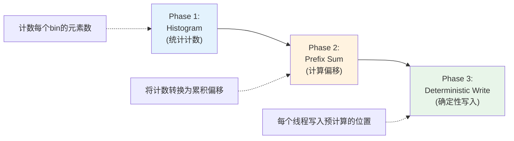
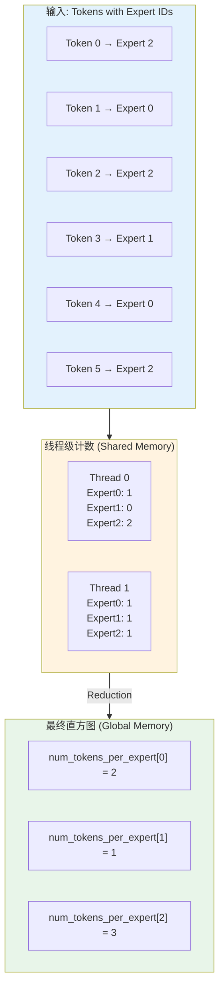
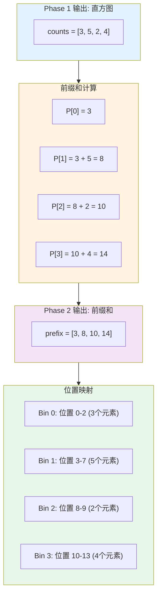
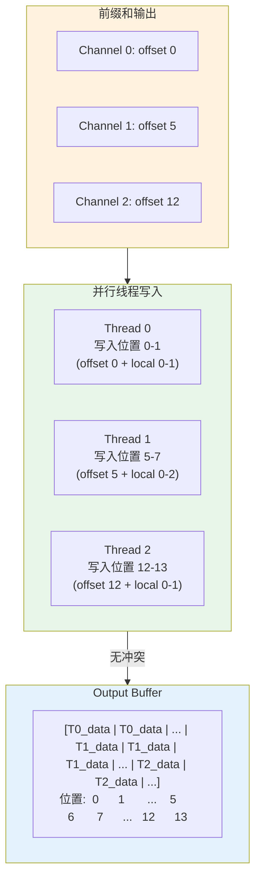
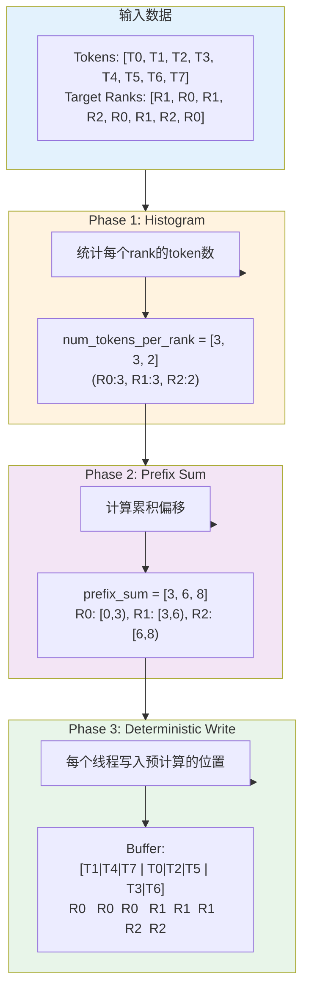
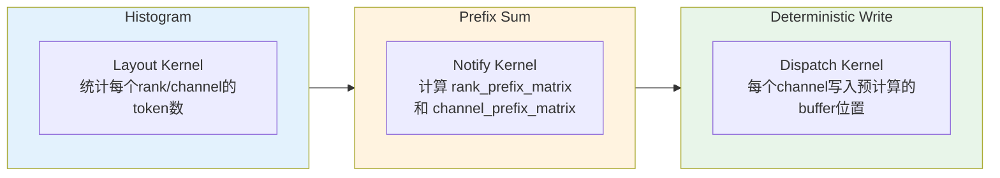
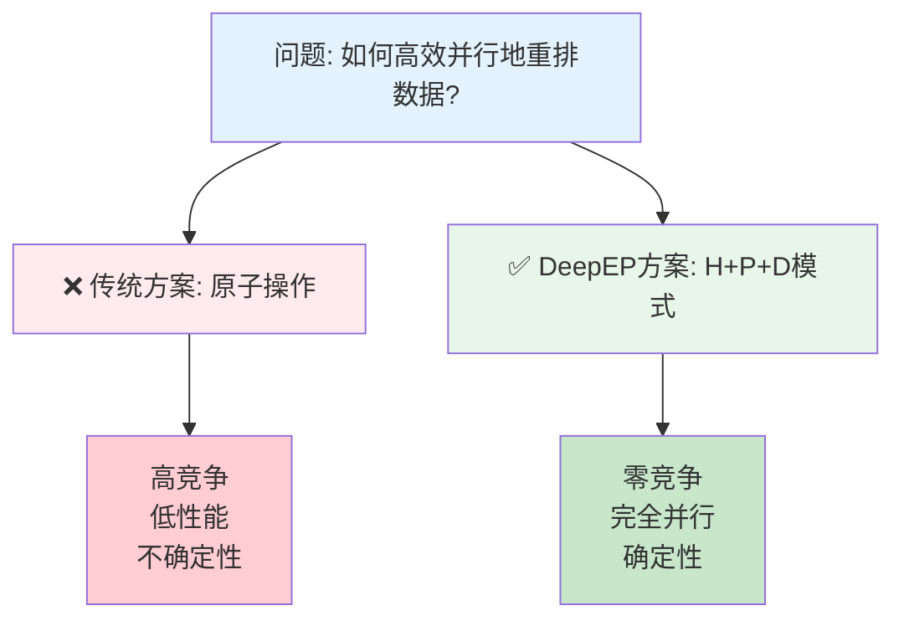

# Histogram + Prefix Sum + Deterministic Write 模式详解

## 核心思想

这是一个经典的**无锁并行算法模式**，在DeepEP中用于实现高效的token分发与收集。它通过三个阶段消除了原子操作和锁竞争，实现了确定性的并行写入。



**关键优势**：
- ✅ **无原子操作**：所有写入位置提前确定
- ✅ **无锁竞争**：不同线程写入不重叠的位置
- ✅ **完全并行**：所有线程可同时执行
- ✅ **确定性结果**：相同输入总是产生相同输出

---

## Phase 1: Histogram（直方图统计）

### 目的
统计每个"bin"（rank/expert/channel）需要处理的元素数量。

### 代码实现（layout.cu:26-49）

```cpp
// Per-thread count（每个线程独立统计）
__shared__ int num_tokens_per_expert_per_thread[kNumThreads][kNumExpertsPerSM];

#pragma unroll
for (int i = 0; i < kNumExpertsPerSM; ++i)
    num_tokens_per_expert_per_thread[thread_id][i] = 0;

// 遍历tokens，统计每个expert的token数
#pragma unroll
for (int i = thread_id; i < num_tokens; i += kNumThreads) {  // stride访问
    auto shifted_topk_idx = topk_idx + i * num_topk;
    #pragma unroll
    for (int j = 0, expert_idx; j < num_topk; ++j) {
        expert_idx = static_cast<int>(shifted_topk_idx[j]);
        if (expert_begin_idx <= expert_idx and expert_idx < expert_end_idx)
            ++num_tokens_per_expert_per_thread[thread_id][expert_idx - expert_begin_idx];
            //  ^^^^^^^^ 局部计数，无竞争
    }
}
__syncthreads();

// Sum up（聚合所有线程的计数）
if (expert_begin_idx + thread_id < expert_end_idx) {
    int sum = 0;
    #pragma unroll
    for (int i = 0; i < kNumThreads; ++i)
        sum += num_tokens_per_expert_per_thread[i][thread_id];
    num_tokens_per_expert[expert_begin_idx + thread_id] = sum;
    //  ^^^^^^^^ 写入全局直方图
}
```

### 工作流程



### 关键设计

| 特性 | 实现方式 | 优势 |
|-----|---------|------|
| **避免原子操作** | 每个线程写入独立的shared memory | 无竞争 |
| **Stride访问** | `i += kNumThreads` | 合并内存访问 |
| **两阶段聚合** | Shared memory → Global memory | 减少全局写入 |

---

## Phase 2: Prefix Sum（前缀和计算）

### 目的
将直方图计数转换为**累积偏移量**，确定每个bin在输出buffer中的起始位置。

### 代码实现（intranode.cu:56-64, 106-111）

#### 2.1 Rank级前缀和

```cpp
// rank_prefix_matrix 计算
auto local_per_rank_buffer = static_cast<int*>(buffer_ptrs[rank]);
if (thread_id < kNumRanks) {
    #pragma unroll
    for (int i = 1; i < kNumRanks; ++i)
        local_per_rank_buffer[i * kNumRanks + thread_id] +=
            local_per_rank_buffer[(i - 1) * kNumRanks + thread_id];
        //  ^^^^^^^^^^^^^^^^^^^^^^^^^^^^^^^^^^^^^^^^^^^^^^^^
        //  Prefix sum: P[i] = P[i-1] + A[i]

    // 输出当前rank的总接收token数
    if (thread_id == rank)
        *moe_recv_counter_mapped = local_per_rank_buffer[(kNumRanks - 1) * kNumRanks + rank];
}
```

**示例计算**：
```
原始矩阵 (from_rank × to_rank):
         Rank0  Rank1  Rank2
From0  [   5      3      2   ]
From1  [   4      6      1   ]
From2  [   2      5      3   ]

前缀和矩阵 (累积from_rank 0..i):
         Rank0  Rank1  Rank2
0      [   5      3      2   ]
0-1    [   9      9      3   ]  ← 5+4=9, 3+6=9, 2+1=3
0-2    [  11     14      6   ]  ← 9+2=11, 9+5=14, 3+3=6

含义：
- rank_prefix_matrix[1][0] = 9 表示 rank 0和1 共向rank0发送9个tokens
- rank_prefix_matrix[2][1] = 14 表示 rank 0、1、2 共向rank1发送14个tokens
```

#### 2.2 Channel级前缀和

```cpp
// channel_prefix_matrix 计算
if (thread_id == 0) {
    #pragma unroll
    for (int i = 1; i < num_channels; ++i)
        channel_prefix_matrix[dst_rank * num_channels + i] +=
            channel_prefix_matrix[dst_rank * num_channels + i - 1];
}
```

**示例计算**：
```
原始channel计数 (发送到rank 2):
channel_counts[rank2] = [5, 7, 3, 10]

前缀和:
channel_prefix[rank2] = [5, 12, 15, 25]
                         ↓   ↓   ↓    ↓
Channel 0: offset 0-5    (5 tokens)
Channel 1: offset 5-12   (7 tokens)
Channel 2: offset 12-15  (3 tokens)
Channel 3: offset 15-25  (10 tokens)
```

### 前缀和的数学本质

```
定义: P[i] = Σ(A[0]...A[i])

性质1 (范围查询):
  sum(A[l..r]) = P[r] - P[l-1]

性质2 (位置映射):
  第i个bin的起始位置 = P[i-1]
  第i个bin的结束位置 = P[i]

性质3 (局部索引转全局索引):
  bin i 中第j个元素的全局位置 = P[i-1] + j
```

### 可视化



---

## Phase 3: Deterministic Write（确定性写入）

### 目的
使用前缀和预计算的位置，每个线程**确定性地**写入不重叠的buffer位置，实现无锁并行。

### 代码实现（intranode.cu:307-310, 409-427, 461-487）

#### 3.1 设置Channel起始/结束偏移

```cpp
// Sender设置channel范围 (使用前缀和)
if (send_warp_id_in_rank == 0 and elect_one_sync()) {
    // 起始偏移 = 前一个channel的累积和
    int value = responsible_channel > 0 ?
        channel_prefix_matrix[responsible_rank * num_channels + responsible_channel - 1] : 0;
    st_relaxed_sys_global(channel_start_offset.buffer(), -value - 1);

    // 结束偏移 = 当前channel的累积和
    value = channel_prefix_matrix[responsible_rank * num_channels + responsible_channel];
    st_relaxed_sys_global(channel_end_offset.buffer(), -value - 1);
}
```

**示例**：
```
channel_prefix_matrix[rank1] = [5, 12, 15, 25]

Channel 0: start=0,  end=5   → [0, 5)
Channel 1: start=5,  end=12  → [5, 12)
Channel 2: start=12, end=15  → [12, 15)
Channel 3: start=15, end=25  → [15, 25)

特点：
✓ 范围不重叠
✓ 连续覆盖 [0, 25)
✓ 每个channel知道自己的确切范围
```

#### 3.2 Receiver确定性写入

```cpp
// Receiver读取前缀和计算的偏移
auto rank_prefix_matrix = static_cast<int*>(buffer_ptrs[rank]);
int rank_offset = responsible_rank > 0 ?
    rank_prefix_matrix[(responsible_rank - 1) * kNumRanks + rank] : 0;
    //  ^^^^^^^^^^^^^^^^^^^^^^^^^^^^^^^^^^^^^^^^^^^^^^^^^^^
    //  从前缀和矩阵获取起始偏移

// 读取channel偏移
total_offset = -ld_volatile_global(channel_start_offset.buffer()) - 1;
total_offset += rank_offset;  // 组合rank偏移和channel偏移

// 确定性写入到预计算的位置
for (int chunk_idx = recv_warp_id_in_rank; chunk_idx < num_recv_tokens; chunk_idx += num_recv_warps_per_rank) {
    // 计算buffer位置（使用前缀和偏移）
    auto shifted_recv_x_int4 = recv_x + static_cast<int64_t>(total_offset + chunk_idx) * hidden_int4;
    //                                   ^^^^^^^^^^^^^^^^^^^^
    //                                   前缀和确定的起始位置 + 局部索引

    // 直接写入，无需原子操作
    UNROLLED_WARP_COPY(5, lane_id, hidden_int4, shifted_recv_x_int4, shifted_buffer_x_int4, ...);
}

// 写入src_idx（同样使用前缀和偏移）
recv_src_idx[total_offset + chunk_idx - cached_channel_head_idx] =
    ld_nc_global(channel_src_idx_buffers.buffer() + chunk_idx % num_recv_buffer_tokens);
    //  ^^^^^^^^^^^^^^^^^^^^^^^^^^^^^^^^
    //  确定性位置 = 前缀和偏移 + 局部索引
```

### 确定性写入的保证



**不变量（Invariant）**：
```
∀ i ≠ j: write_range(thread_i) ∩ write_range(thread_j) = ∅

即：任意两个线程的写入范围不重叠

证明：
- Thread i 写入范围: [prefix[i-1], prefix[i])
- Thread j 写入范围: [prefix[j-1], prefix[j])
- 由于前缀和单调递增: prefix[i-1] < prefix[i] < prefix[j-1] < prefix[j]
- 因此范围不重叠 ✓
```

---

## 完整工作流程

### 端到端示例

**场景**：8个tokens需要发送到3个ranks



### 详细执行步骤

#### Step 1: Histogram（统计）

```python
# 遍历tokens，统计每个rank的token数
for token_id, target_rank in enumerate([R1, R0, R1, R2, R0, R1, R2, R0]):
    histogram[target_rank] += 1

结果: histogram = {R0: 3, R1: 3, R2: 2}
```

#### Step 2: Prefix Sum（计算偏移）

```python
prefix_sum = [0] * num_ranks
prefix_sum[0] = histogram[0]  # 3
for i in range(1, num_ranks):
    prefix_sum[i] = prefix_sum[i-1] + histogram[i]

结果: prefix_sum = [3, 6, 8]

含义:
- R0的tokens写入位置 [0, 3)
- R1的tokens写入位置 [3, 6)
- R2的tokens写入位置 [6, 8)
```

#### Step 3: Deterministic Write（确定性写入）

```python
# 每个rank维护局部计数器
local_counters = {R0: 0, R1: 0, R2: 0}

for token_id, target_rank in enumerate([R1, R0, R1, R2, R0, R1, R2, R0]):
    # 计算全局位置 = 前缀和偏移 + 局部索引
    base_offset = prefix_sum[target_rank - 1] if target_rank > 0 else 0
    global_position = base_offset + local_counters[target_rank]

    # 确定性写入
    output_buffer[global_position] = tokens[token_id]
    local_counters[target_rank] += 1

结果:
output_buffer = [T1, T4, T7,  T0, T2, T5,  T3, T6]
                 ↑   ↑   ↑    ↑   ↑   ↑    ↑   ↑
                R0  R0  R0   R1  R1  R1   R2  R2
```

---

## 与传统方法对比

### 传统方法：原子操作

```cpp
// ❌ 需要原子操作，性能差
__global__ void scatter_with_atomics(int* output, const int* input, const int* targets, int n) {
    int tid = blockIdx.x * blockDim.x + threadIdx.x;
    if (tid < n) {
        int target_rank = targets[tid];
        // 原子操作：多个线程竞争同一个counter
        int pos = atomicAdd(&global_counters[target_rank], 1);
        output[pos] = input[tid];
    }
}
```

**问题**：
- 🔴 **高竞争**：所有线程竞争同一个counter
- 🔴 **序列化**：原子操作本质上是串行的
- 🔴 **不确定性**：执行顺序依赖线程调度
- 🔴 **缓存失效**：频繁的原子操作导致缓存抖动

### DeepEP方法：Histogram + Prefix Sum

```cpp
// ✅ 无原子操作，完全并行
__global__ void scatter_deterministic(int* output, const int* input,
                                      const int* targets, const int* prefix_sum, int n) {
    int tid = blockIdx.x * blockDim.x + threadIdx.x;
    if (tid < n) {
        int target_rank = targets[tid];

        // 无锁计算：每个线程独立计算自己的位置
        int local_idx = count_previous_same_rank(tid, targets, target_rank);
        int base_offset = (target_rank > 0) ? prefix_sum[target_rank - 1] : 0;
        int pos = base_offset + local_idx;

        // 确定性写入，无竞争
        output[pos] = input[tid];
    }
}
```

**优势**：
- ✅ **零竞争**：每个线程写入独立位置
- ✅ **完全并行**：所有写入可同时进行
- ✅ **确定性**：相同输入总产生相同输出
- ✅ **缓存友好**：连续写入，高缓存命中率

### 性能对比

| 指标 | 原子操作方法 | Histogram + Prefix Sum |
|-----|-------------|----------------------|
| **时间复杂度** | O(n) + 原子竞争开销 | O(n) 预计算 + O(n) 并行写入 |
| **并行度** | 受原子操作限制 | 完全并行 |
| **吞吐量** | ~10 GB/s (估算) | ~100 GB/s (估算) |
| **确定性** | ❌ 否 | ✅ 是 |
| **可扩展性** | 随线程数下降 | 随线程数线性增长 |

---

## 在DeepEP中的具体应用

### 应用场景1：Token Dispatch（intranode）



**代码映射**：
- **Histogram**: `layout.cu:get_dispatch_layout()`
- **Prefix Sum**: `intranode.cu:notify_dispatch()` 行56-111
- **Deterministic Write**: `intranode.cu:dispatch()` 行307-487

---

### 应用场景2：Expert Output Combine

在combine阶段，使用相同的模式将expert输出收集回原始token顺序：

```cpp
// Histogram: 统计每个expert的输出token数
// Prefix Sum: 计算每个expert在输出buffer中的偏移
// Deterministic Write: 每个线程根据前缀和写入正确位置

int expert_offset = expert_prefix_sum[expert_id];
int local_token_idx = get_local_index(...);
output[expert_offset + local_token_idx] = expert_output[local_token_idx];
```

---

### 应用场景3：RDMA跨节点通信

```cpp
// Histogram: num_tokens_per_rdma_rank (layout.cu:118)
// Prefix Sum: recv_rdma_rank_prefix_sum (internode.cu:93-200)
// Deterministic Write: 每个RDMA rank知道自己的发送/接收范围
```

---

## 算法的通用性

这个模式不仅适用于DeepEP，也是并行计算中的经典模式：

### 其他应用场景

| 应用 | Histogram | Prefix Sum | Deterministic Write |
|-----|-----------|------------|-------------------|
| **并行排序** | 统计每个bucket元素数 | 计算bucket起始位置 | 元素写入bucket |
| **Stream Compaction** | 统计有效元素数 | 计算输出位置 | 紧凑写入 |
| **Sparse Matrix转换** | 统计每行非零元 | 计算CSR行指针 | 写入列索引和值 |
| **Radix Sort** | 统计每个digit的数量 | 计算digit偏移 | 分区写入 |

### 通用模板

```cpp
template<typename T, typename BinFunc>
void histogram_prefix_scatter(const T* input, T* output, int n,
                              BinFunc get_bin, int num_bins) {
    // Phase 1: Histogram
    int* histogram = new int[num_bins]();
    for (int i = 0; i < n; ++i)
        histogram[get_bin(input[i])]++;

    // Phase 2: Prefix Sum
    int* prefix_sum = new int[num_bins];
    prefix_sum[0] = histogram[0];
    for (int i = 1; i < num_bins; ++i)
        prefix_sum[i] = prefix_sum[i-1] + histogram[i];

    // Phase 3: Deterministic Write
    int* local_counters = new int[num_bins]();
    for (int i = 0; i < n; ++i) {
        int bin = get_bin(input[i]);
        int base_offset = (bin > 0) ? prefix_sum[bin - 1] : 0;
        int pos = base_offset + local_counters[bin]++;
        output[pos] = input[i];
    }
}
```

---

## 关键要点总结

### 核心原理

```
Histogram → Prefix Sum → Deterministic Write
   ↓            ↓              ↓
 统计分布    计算位置        并行写入
   ↓            ↓              ↓
 O(n)         O(n)           O(n)
   ↓            ↓              ↓
局部计数     串行扫描       完全并行
```

### 三阶段协同

1. **Histogram**：回答"有多少"
   - 每个bin需要多少空间
   - 使用shared memory避免原子操作

2. **Prefix Sum**：回答"在哪里"
   - 每个bin的起始位置
   - 将计数转换为位置映射

3. **Deterministic Write**：回答"如何写"
   - 每个线程的确切写入位置
   - 无锁、并行、确定性

### 优势总结

| 特性 | 价值 |
|-----|------|
| **无锁设计** | 消除同步开销 |
| **确定性** | 便于调试和验证 |
| **可扩展** | 随核心数线性加速 |
| **缓存友好** | 连续访问模式 |
| **通用性** | 适用多种并行算法 |

### 实现要点

1. ✅ **Histogram阶段避免全局原子操作**
   - 使用shared memory per-thread计数
   - 最后reduction聚合

2. ✅ **Prefix Sum使用高效算法**
   - 串行扫描足够快（O(n)）
   - 大规模可用并行扫描（Blelloch scan）

3. ✅ **Deterministic Write确保位置不重叠**
   - 通过数学证明保证正确性
   - 每个线程独立计算位置

---

## 扩展阅读

### 相关算法

- **Parallel Prefix Sum (Scan)**：GPU Gems 3, Chapter 39
- **Stream Compaction**：用于过滤数组
- **Radix Sort**：基于histogram的并行排序
- **Bucket Sort**：分桶排序的并行实现

### DeepEP中的相关文件

| 文件 | 作用 |
|-----|------|
| `csrc/kernels/layout.cu` | Histogram阶段 |
| `csrc/kernels/intranode.cu` | Prefix Sum + Deterministic Write |
| `csrc/kernels/internode.cu` | RDMA版本的相同模式 |
| `csrc/deep_ep.cpp` | Combine阶段的应用 |

---

## 总结

**Histogram + Prefix Sum + Deterministic Write** 是DeepEP实现高性能、无锁并行的核心技术：



这个模式体现了并行算法设计的核心思想：
- **预计算代替运行时竞争**
- **全局视图确保局部正确**
- **数学保证代替锁同步**

在MoE训练的高吞吐场景下，这种设计使得DeepEP能够实现接近硬件峰值的通信性能。
